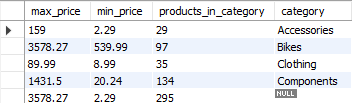

# Otus internet shop. Grouping (MySQL) 

В качестве исходных данных брался проект AdventureWorks для MySQl 
https://github.com/tapsey/AdventureWorksMYSQL/blob/master/AdventureWorks-MySQL-with-FKs.zip

    1) Для магазина к предыдущему списку продуктов добавить максимальную и минимальную цену и кол-во предложений

    use adventureworks;
    select max(ListPrice) as max_price, 
    min(ListPrice) as min_price, 
    count(1) as products_in_category, 
    productcategory.Name as category from product
    left join productsubcategory on product.ProductSubcategoryID = productsubcategory.ProductSubcategoryID
    left join productcategory on productsubcategory.ProductCategoryID = productcategory.ProductCategoryID
    where product.ProductSubcategoryID is not null group by category with rollup;
   
   
    Результат:

    Из результата видно максимальную и минимальную сумму по категориям, а также минимальную и максимальную по всем категориям.
    А также количество предложений в каждой категории и общая сумма.

    2) Также сделать выборку показывающую самый дорогой и самый дешевый товар в каждой категории
    use adventureworks;
    with category_product as (
    select product.ProductID as product_id,
    product.Name as product_name,
    product.ListPrice as product_price,
    productcategory.Name as category from product
    left join productsubcategory on product.ProductSubcategoryID = productsubcategory.ProductSubcategoryID
    left join productcategory on productsubcategory.ProductCategoryID = productcategory.ProductCategoryID
    where product.ProductSubcategoryID is not null
    ),
    product_distribution as (
    select max(product_price) as max_category_price,
    min(product_price) as min_category_price,
    count(1) as products_in_category,
    category
    from category_product
    group by category
    )
    select min_category_price, max_category_price, product_id, product_name, product_price, product_distribution.category 
    from product_distribution
    left join category_product on (product_distribution.category = category_product.category)
    where category_product.product_price = min_category_price or category_product.product_price = max_category_price
    order by category, product_price;

    Результат:

    Из результата видно по категориям какие продукты имеют минимальную цену ,а какие максимальную.

