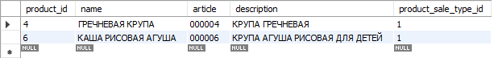
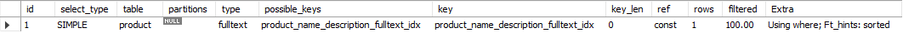
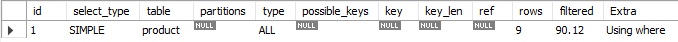

# Otus internet shop (MySql). Indexes

В файле ./create_index.sql представлены все индексы в проекте. Индексы сделаны для всех FK, а также
для таблиц товаров (product) и мест (location_info) созданы полнотекстовые индексы:

create fulltext index product_name_description_fulltext_idx on product (name, description);

create fulltext index location_info_city_fulltext_idx on location_info (city, street);

Тестовые данные заливалиь скриптом ./setup_data.sql

Результаты выборки:

1. С индексом    
    select * from product where match (name, description) against ('КРУПА');
    
    
    explain select * from product where match (name, description) against ('КРУПА');
    
   
2. Без индекса 
    select * from product where name or description like '%КРУПА%';
   

   explain select * from product where name or description like '%КРУПА%';
   

