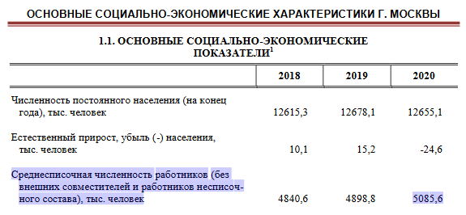

# Otus internet shop (MySQL). Replication

При прогнозе используем предположение, что наш магазин через год охватит 1% рынка продаж товаров в Москве.

1) Рост количества пользователей.
   Согласно показателям Москвы, за 2020 год количество работников равнялось примерно 5 млн. человек.
   https://mosstat.gks.ru/storage/mediabank/l8yYprEH/%D0%9C%D0%BE%D1%81%D0%BA%D0%B2%D0%B0%20%D0%B2%20%D1%86%D0%B8%D1%84%D1%80%D0%B0%D1%85,%202021.pdf
   
   
   Предполагаем, что на каждого работника создается один аккаунт в интернет-магазинах. Таким образом считаем, что за год
   в нашем интернет-магазине будет порядка 50000 пользователей.

2) Прогноз по возможному росту базы данных.

   При продажах активно используются рекламные компании на разных площадках (в том числе цифровых). С целью контроля конверсии 
   бизнес явно захочет видеть данные по рекламным компаниям (что за компания, бюджет, кто исполнитель, конверсия и т.д.). 
   Также необходимы будут аналитические данные по продажам товаров. Таким образом появится необходимость построения OLAP БД.
   
3) Прогноз роста данных

   При заливке тестовых данных из директории ./sql мы получаем следующие данные из запроса:
   SELECT table_schema AS "Database", SUM(data_length + index_length) / 1024 / 1024 AS "Size (MB)" FROM information_schema.TABLES GROUP BY table_schema;

   information_schema	0.00000000
   mysql	            7.87500000
   otus_internet_shop	0.90625000
   performance_schema	0.00000000
   sys	                0.01562500
   
   Таким образом, наша БД весит примерно 1 МБ. 
   На данный момент в базе:
    - 4 пользователя
    - 6 поставщиков
    - 2 заказа
    - 8 подзаказов
   
   Рассчитаем примерный размер БД на основании самых больших таблиц (без учета индексов):

   customer_sub_order: 4 + 4 + 5 = 13 byte
   customer_order: 4 + 8 + 8 + 5 + 5 + 4 + 4 = 38 byte
   customer_order_delivery: 4 + 3 + 100 + 4 + 4 + 4 + 4 = 123 byte
   
   Мы предполагаем 50000 пользователей, который совершают 4 покупки в месяц с 10 позициями в чеке.
   Тогда получим следующие данные по размерам таблиц:
   customer_sub_order: 13 * 50000 * 4 * 12 * 10 = 290 MB
   customer_order: 38 * 50000 * 4 * 12 = 87 MB
   customer_order_delivery: 123 * 50000 * 4 * 12 = 282 MB
   
   Итого: 659 MB

   Прочие таблицы меньше, полагаем что суммарно будет не более 1 GB. Для индексов полагаем что будет достаточно 4 Gb.
   В сумме для нашей БД достаточно 5 Gb.
   
4) Всплески одновременных соединений

   Предполагаем, что в дни распродаж всплеск может достигать 10% от всех покупателей, т.е. 5000 пользователей.
   Принимаем, что бэкэнд использует пул соединений с размером 1000. 
   Согласно https://raazkumar.com/tutorials/mysql/mysql-max-connections/ для 1 соединения требуется 10 MB.
   Для поддержки 1000 соединений потребуется порядка 16 GB оперативной памяти.
   
5) Возможные угрозы и методы защиты от них

   В статье https://www.softwaretestinghelp.com/database-security-testing/#Types_Of_Threats_On_Database
   указаны угрозы для БД и как с ними бороться (есть перевод отуса: https://habr.com/ru/company/otus/blog/557296/).
   
6) Стратегия бэкапа

   Существует несколько стратегий резервного копирования:

   * Стратегия 3-2-1
      - Правило 3: для любой информации создаются как минимум три резервных копии.
      - Правило 2: для хранения резервных копий используется как минимум два носителя.
      - Правило 1: один из носителей копии должен быть физически отделён от источника данных 
        (то есть, подключаться к компьютеру только по сети или через USB-слот).
   
   * Стратегия «Дед-Отец-Сын» (Grandfather-Father-Son, GFS)
     Стратегия корпоративного уровня.
      - «Дед»: сохранение полной резервной копии данных в удалённое от компьютера хранилище, обычно наилучшим образом 
        защищённое (например, S3-облака).
      - «Отец»: более частое полное резервное копирование на более доступный, чем «дедовский», носитель данных 
        (например, на локальный диск или FTP-сервер).
      - «Сын»: частый неполный (инкрементальный или дифференциальный) бэкап в «отцовское» хранилище данных.
   
   * Ханойская башня
     Сперва устанавливается интервал времени между выполнениями задач бэкапа (скажем, в один день). 
     Затем резервное копирование на первый выбранный носитель информации выполняется каждый второй интервал времени. 
     Копирование на второй носитель выполняется в тот интервал, когда нет копирования на первый носитель, 
     и затем каждый четвёртый интервал. Наконец, резервное копирование на третий носитель выполняется в те интервалы, 
     когда не выполняется копирование ни на первый, ни на второй носители, и затем каждый восьмой интервал, и так далее.
     
   По мере роста данных и увеличения ресурсов можно двигаться от стратегии Grandfather-Father-Son к Ханойской башне. 

7) Репликация
    См. п 8).

8) Кластеризация

    Для отказоустойчивости и балансировки чтения предлагается использовать InnoDB cluster в режиме multi-master 
   (не очень понятно как будет справляться одна мастер-нода при большом количестве операций записи).