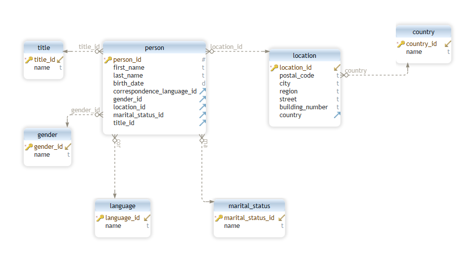

# Otus internet shop. Data model

Для решения предлагается следующая модель данных:

Выделены сущности-справочники: title, gender, language, marital_status, country.

Для описания местоположения человека используется сущность location. В ней нет выделенных справочников регионов, городов, 
улиц и домов, т.к. эти данные в идеале должны пересекаться со страной (в разных странах могут быть одинаковые названия городов).
А это усложняет модель данных.

1) Создаем модель данных (./create_schema.sql)
2) Загружаем csv в промежуточную таблицу (./create_tmp_table.sql)
3) Создаем необходимые хранимые процедуры (./setup-data_procedure.sql)
4) Выполняем call setupData();