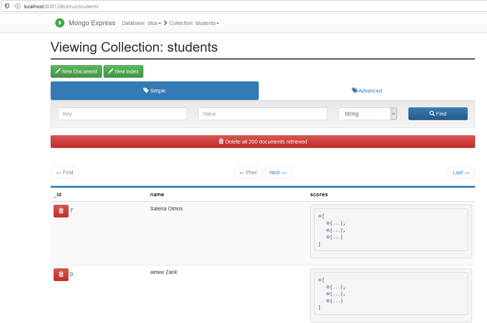

# Otus internet shop (MongoDB).

Разворачиваем MongoDB в докере вместе с mongo-express.

Переходим в консоль mongo:

mongo -u "root" -p "12345"
use otus
db.createCollection("people") - коллекция создается.

Заливаем тестовые данные из гитхаба.
mongoimport /tmp/students.json --port 27017 -u root -p 12345 --authenticationDatabase admin -d otus --collection students
Проверяем в mongo-express:

Запросы:
db.students.find({"_id" : 21})
{ "_id" : 21, "name" : "Rosana Vales", "scores" : [ { "score" : 46.2289476258328, "type" : "exam" }, 
{ "score" : 98.34164225207036, "type" : "quiz" }, { "score" : 36.18769746805938, "type" : "homework" } ] }

db.students.find().limit(5)
{ "_id" : 7, "name" : "Salena Olmos", "scores" : [ { "score" : 90.37826509157176, "type" : "exam" }, 
{ "score" : 42.48780666956811, "type" : "quiz" }, { "score" : 96.52986171633331, "type" : "homework" } ] }
{ "_id" : 0, "name" : "aimee Zank", "scores" : [ { "score" : 1.463179736705023, "type" : "exam" }, 
{ "score" : 11.78273309957772, "type" : "quiz" }, { "score" : 35.8740349954354, "type" : "homework" } ] }
{ "_id" : 8, "name" : "Daphne Zheng", "scores" : [ { "score" : 22.13583712862635, "type" : "exam" }, 
{ "score" : 14.63969941335069, "type" : "quiz" }, { "score" : 75.94123677556644, "type" : "homework" } ] }
{ "_id" : 9, "name" : "Sanda Ryba", "scores" : [ { "score" : 97.00509953654694, "type" : "exam" }, 
{ "score" : 97.80449632538915, "type" : "quiz" }, { "score" : 25.27368532432955, "type" : "homework" } ] }
{ "_id" : 3, "name" : "Bao Ziglar", "scores" : [ { "score" : 71.64343899778332, "type" : "exam" }, 
{ "score" : 24.80221293650313, "type" : "quiz" }, { "score" : 42.26147058804812, "type" : "homework" } ] }

db.students.update({"_id" : 21}, {$set : {"name" : "Anton Bagryanov"}})
db.students.find({"_id" : 21})
{ "_id" : 21, "name" : "Anton Bagryanov", "scores" : [ { "score" : 46.2289476258328, "type" : "exam" }, 
{ "score" : 98.34164225207036, "type" : "quiz" }, { "score" : 36.18769746805938, "type" : "homework" } ] }

Индексы:

Выполнима запрос без индексов:

db.students.explain("executionStats").find({"name" : {$regex: "Ali"}})
{
"explainVersion" : "1",
"queryPlanner" : {
"namespace" : "otus.students",
"indexFilterSet" : false,
"parsedQuery" : {
"name" : {
"$regex" : "Rosana"
}
},
"maxIndexedOrSolutionsReached" : false,
"maxIndexedAndSolutionsReached" : false,
"maxScansToExplodeReached" : false,
"winningPlan" : {
"stage" : "COLLSCAN",
"filter" : {
"name" : {
"$regex" : "Rosana"
}
},
"direction" : "forward"
},
"rejectedPlans" : [ ]
},
"executionStats" : {
"executionSuccess" : true,
"nReturned" : 1,
"executionTimeMillis" : 0,
"totalKeysExamined" : 0,
"totalDocsExamined" : 200,
"executionStages" : {
"stage" : "COLLSCAN",
"filter" : {
"name" : {
"$regex" : "Rosana"
}
},
"nReturned" : 1,
"executionTimeMillisEstimate" : 0,
"works" : 202,
"advanced" : 1,
"needTime" : 200,
"needYield" : 0,
"saveState" : 0,
"restoreState" : 0,
"isEOF" : 1,
"direction" : "forward",
"docsExamined" : 200
}
},
"command" : {
"find" : "students",
"filter" : {
"name" : {
"$regex" : "Rosana"
}
},
"$db" : "otus"
},
"serverInfo" : {
"host" : "bf0956013e20",
"port" : 27017,
"version" : "5.0.4",
"gitVersion" : "62a84ede3cc9a334e8bc82160714df71e7d3a29e"
},
"serverParameters" : {
"internalQueryFacetBufferSizeBytes" : 104857600,
"internalQueryFacetMaxOutputDocSizeBytes" : 104857600,
"internalLookupStageIntermediateDocumentMaxSizeBytes" : 104857600,
"internalDocumentSourceGroupMaxMemoryBytes" : 104857600,
"internalQueryMaxBlockingSortMemoryUsageBytes" : 104857600,
"internalQueryProhibitBlockingMergeOnMongoS" : 0,
"internalQueryMaxAddToSetBytes" : 104857600,
"internalDocumentSourceSetWindowFieldsMaxMemoryBytes" : 104857600
},
"ok" : 1
}

Создадим индекс на поле name.
db.students.createIndex({name : "text"})
db.students.find({ $text: { $search: "Rosana"}}).explain("executionStats")
{
"explainVersion" : "1",
"queryPlanner" : {
"namespace" : "otus.students",
"indexFilterSet" : false,
"parsedQuery" : {
"$text" : {
"$search" : "Rosana",
"$language" : "english",
"$caseSensitive" : false,
"$diacriticSensitive" : false
}
},
"maxIndexedOrSolutionsReached" : false,
"maxIndexedAndSolutionsReached" : false,
"maxScansToExplodeReached" : false,
"winningPlan" : {
"stage" : "TEXT_MATCH",
"indexPrefix" : {

                        },
                        "indexName" : "name_text",
                        "parsedTextQuery" : {
                                "terms" : [
                                        "rosana"
                                ],
                                "negatedTerms" : [ ],
                                "phrases" : [ ],
                                "negatedPhrases" : [ ]
                        },
                        "textIndexVersion" : 3,
                        "inputStage" : {
                                "stage" : "FETCH",
                                "inputStage" : {
                                        "stage" : "IXSCAN",
                                        "keyPattern" : {
                                                "_fts" : "text",
                                                "_ftsx" : 1
                                        },
                                        "indexName" : "name_text",
                                        "isMultiKey" : true,
                                        "isUnique" : false,
                                        "isSparse" : false,
                                        "isPartial" : false,
                                        "indexVersion" : 2,
                                        "direction" : "backward",
                                        "indexBounds" : {

                                        }
                                }
                        }
                },
                "rejectedPlans" : [ ]
        },
        "executionStats" : {
                "executionSuccess" : true,
                "nReturned" : 1,
                "executionTimeMillis" : 0,
                "totalKeysExamined" : 1,
                "totalDocsExamined" : 1,
                "executionStages" : {
                        "stage" : "TEXT_MATCH",
                        "nReturned" : 1,
                        "executionTimeMillisEstimate" : 0,
                        "works" : 2,
                        "advanced" : 1,
                        "needTime" : 0,
                        "needYield" : 0,
                        "saveState" : 0,
                        "restoreState" : 0,
                        "isEOF" : 1,
                        "indexPrefix" : {

                        },
                        "indexName" : "name_text",
                        "parsedTextQuery" : {
                                "terms" : [
                                        "rosana"
                                ],
                                "negatedTerms" : [ ],
                                "phrases" : [ ],
                                "negatedPhrases" : [ ]
                        },
                        "textIndexVersion" : 3,
                        "docsRejected" : 0,
                        "inputStage" : {
                                "stage" : "FETCH",
                                "nReturned" : 1,
                                "executionTimeMillisEstimate" : 0,
                                "works" : 2,
                                "advanced" : 1,
                                "needTime" : 0,
                                "needYield" : 0,
                                "saveState" : 0,
                                "restoreState" : 0,
                                "isEOF" : 1,
                                "docsExamined" : 1,
                                "alreadyHasObj" : 0,
                                "inputStage" : {
                                        "stage" : "IXSCAN",
                                        "nReturned" : 1,
                                        "executionTimeMillisEstimate" : 0,
                                        "works" : 2,
                                        "advanced" : 1,
                                        "needTime" : 0,
                                        "needYield" : 0,
                                        "saveState" : 0,
                                        "restoreState" : 0,
                                        "isEOF" : 1,
                                        "keyPattern" : {
                                                "_fts" : "text",
                                                "_ftsx" : 1
                                        },
                                        "indexName" : "name_text",
                                        "isMultiKey" : true,
                                        "isUnique" : false,
                                        "isSparse" : false,
                                        "isPartial" : false,
                                        "indexVersion" : 2,
                                        "direction" : "backward",
                                        "indexBounds" : {

                                        },
                                        "keysExamined" : 1,
                                        "seeks" : 1,
                                        "dupsTested" : 1,
                                        "dupsDropped" : 0
                                }
                        }
                }
        },
        "command" : {
                "find" : "students",
                "filter" : {
                        "$text" : {
                                "$search" : "Rosana"
                        }
                },
                "$db" : "otus"
        },
        "serverInfo" : {
                "host" : "bf0956013e20",
                "port" : 27017,
                "version" : "5.0.4",
                "gitVersion" : "62a84ede3cc9a334e8bc82160714df71e7d3a29e"
        },
        "serverParameters" : {
                "internalQueryFacetBufferSizeBytes" : 104857600,
                "internalQueryFacetMaxOutputDocSizeBytes" : 104857600,
                "internalLookupStageIntermediateDocumentMaxSizeBytes" : 104857600,
                "internalDocumentSourceGroupMaxMemoryBytes" : 104857600,
                "internalQueryMaxBlockingSortMemoryUsageBytes" : 104857600,
                "internalQueryProhibitBlockingMergeOnMongoS" : 0,
                "internalQueryMaxAddToSetBytes" : 104857600,
                "internalDocumentSourceSetWindowFieldsMaxMemoryBytes" : 104857600
        },
        "ok" : 1
}

Как видно из результата, без индекса выполняется сканирование коллекции и тратится 200 миллисекунд, при наличии индекса, 
поиск выполнился практически мгновенно.