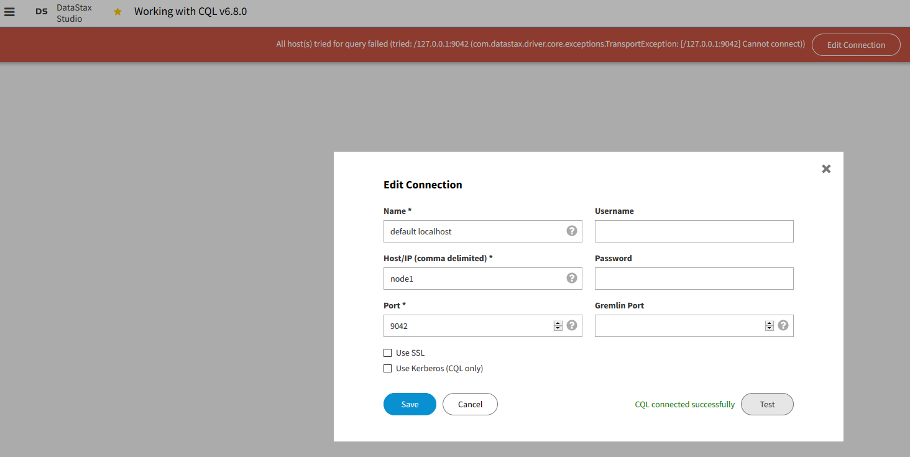

#Otus cassandra

Трехнодный кластер Cassandra реализован в докер-контейнерах datastax.
Подключение проверено с помощью datastax-studio.

Выполняем стресс-тест на ноде node1:
cd /opt/dse/resources/cassandra/tools/bin
./cassandra-stress write n=1000

Results:
Op rate                   :      534 op/s  [WRITE: 534 op/s]
Partition rate            :      534 pk/s  [WRITE: 534 pk/s]
Row rate                  :      534 row/s [WRITE: 534 row/s]
Latency mean              : 341.669 ms [WRITE: 341.7 ms]
Latency median            : 56.558 ms [WRITE: 56.6 ms]
Latency 95th percentile   : 1590.690 ms [WRITE: 1,590.7 ms]
Latency 99th percentile   : 1635.779 ms [WRITE: 1,635.8 ms]
Latency 99.9th percentile : 1648.361 ms [WRITE: 1,648.4 ms]
Latency max               : 1673.527 ms [WRITE: 1,673.5 ms]
Total partitions          :      1,000 [WRITE: 1,000]
Total errors              :          0 [WRITE: 0]
Total GC count            : 0
Total GC memory           : 0.000 KiB
Total GC time             :    0.0 seconds
Avg GC time               :    NaN ms
StdDev GC time            :    0.0 ms
Total operation time      : 00:00:01

END
